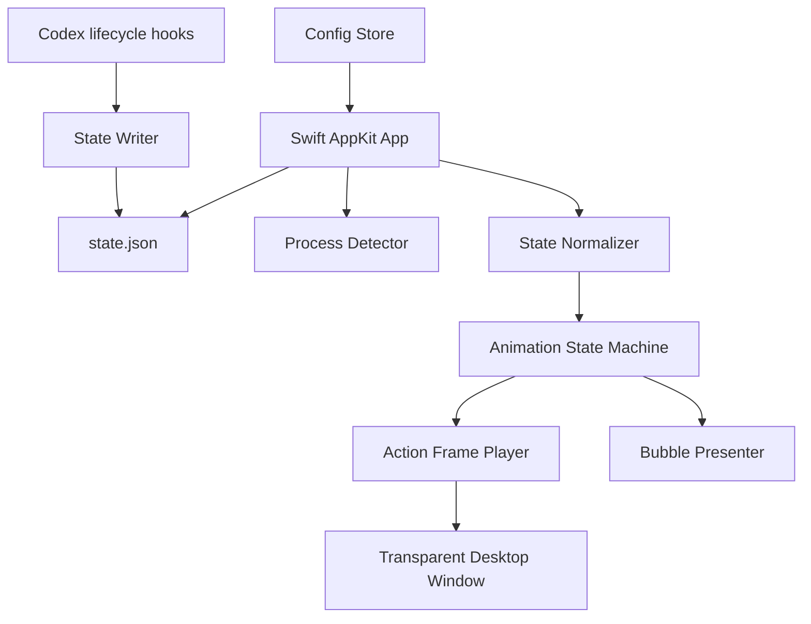

# Codex 桌宠设计文档

日期：2026-06-11
项目目录：`/Users/georgehu/codex/chongwu`
阶段：产品与技术设计 v4

## 1. 设计结论

本版本作为当前开发实现规格，目标是解决三项明确问题：桌宠尺寸不够大、底部舞台和裙摆光点不明显、状态动作没有真正对应 Codex 状态。v8 根据实际视觉反馈调整：当前最协调的是 `codex-running` 梦幻跳舞帧，因此所有状态都使用这套人物动作作为基底，状态差异由播放节奏、气泡、舞台光点和轻量叠加装饰表达。

桌宠方向调整为：**梦幻白色半透明少女桌宠**。她不是普通静态装饰图，也不是 Q 版终端角色，而是一个有舞蹈感、轻盈、发光、半透明的开发陪伴角色。桌宠需要根据 Codex 的运行状态切换动作，让用户不用看终端也能大致知道 Codex 处在“运行、执行命令、等待、成功、失败、长时间运行”等状态。

本设计基于以下判断：

1. 用户明确喜欢参考图里的白色透明少女视觉。
2. 当前 8 帧梦幻少女跳舞动效方向最协调，应作为所有状态的人物动作基底。
3. 桌宠当前面积偏小，默认角色高度必须接近或超过常见 1080p 屏幕高度的一半。
4. 所有状态都保留当前协调跳舞动作；状态语义通过节奏、气泡和叠加装饰区分，避免低质量旧动作造成整图晃动感。

## 2. 关键调整

### 2.1 动画频率

当前帧动画频率偏快。v2 默认改为更慢、更优雅的节奏：

- 默认帧间隔：`0.24s`
- 默认帧率：约 `4.1fps`
- 成功动作可短暂提升到 `0.16s` 每帧
- 错误动作使用 `0.24s` 到 `0.30s` 每帧，突出停顿和观察感
- 长时间运行动作使用 `0.45s` 到 `0.70s` 每帧，避免持续打扰

原则：桌宠看起来像在呼吸、舞动、陪伴，而不是一直快速闪帧。

### 2.2 尺寸

当前桌宠面积需要更大。以 `1920 x 1080` 主屏为基准：

- 透明窗口默认尺寸：`720px x 820px`
- 少女默认显示高度：`600px` 到 `640px`
- 最小显示高度：`500px`
- 最大显示高度：`760px`
- 右键尺寸档位：`90% / 110% / 130%`

窗口仍然要比角色大，给挥手、跳起、裙摆展开和星光留出透明边界，避免裁切。

### 2.3 视觉方向

v2 固定为：

- 白色半透明少女
- 芭蕾或轻舞动作
- 发光裙摆
- 少量蓝白光效
- 轮廓清楚，人物必须像人
- 不使用暗色主体
- 不使用丑的矢量拼接人形
- 不使用大量 UI 字、代码字、终端文字覆盖角色

开发元素只能作为轻量道具或光效出现，例如小键盘、终端光、放大镜、日志册、咖啡杯。它们不能抢走少女主体。

### 2.4 舞台地面与倒影

当前人物下方的蓝色圆角矩形底座不符合目标气质，v2 明确废弃这种做法。桌宠底部应参考用户提供的画面：像一块柔软的水面舞台或月光地面，而不是 UI 卡片或按钮背景。

底部视觉要求：

- 不使用圆角矩形、实心色块、卡片式背景。
- 使用低矮、横向展开的半透明舞台地面。
- 舞台边缘应自然散开，像水面、雾气或光晕，不要有规整边框。
- 人物脚下有很淡的倒影，倒影只表现腿部、裙摆和亮边，不要像镜像复制整个人。
- 裙摆下沿可以随机撒落蓝白光点，光点从裙摆边缘落到舞台地面。
- 光点数量要克制，集中在裙摆下沿和脚边，不能变成满屏粒子。
- 光点必须是动态层：缓慢下落、闪烁、循环，而不是静态点阵。
- 地面整体高度控制在窗口高度的 `10%` 到 `16%`，不能像厚底座。

实现上建议将它拆成独立层：

1. **Stage Reflection Layer**：水面/舞台地面，跟随角色位置缩放。
2. **Soft Reflection Layer**：脚部和裙摆的淡倒影，透明度低。
3. **Falling Sparkle Layer**：少量从裙摆落到地面的光点，可慢速随机闪烁。

这些层应服务于“梦幻舞台感”，不能喧宾夺主。人物仍然是视觉中心。

## 3. 产品定位

产品名称暂定为 **Codex Companion**。

定位：一个 macOS 桌面上的 Codex 状态反馈角色。

体验目标：

1. 让 Codex 运行状态可视化。
2. 让等待任务时更有陪伴感。
3. 动作漂亮，但不吵。
4. 默认状态优雅、低频、轻盈。
5. 关键状态，例如等待输入、成功、失败，要明显。

非目标：

- 不做聊天机器人。
- 不读取代码内容。
- 不上传任何数据。
- 不显示具体命令文本。
- 不做复杂养成系统。

## 4. Codex 状态与动作设计

### 4.1 状态动作总表

| Codex 状态 | 触发条件 | 桌宠动作 | 动作重点 | 气泡 |
| --- | --- | --- | --- | --- |
| `idle` | 未检测到 Codex 或 Codex 空闲 | 极慢速梦幻跳舞 | 安静、低频、像在等你回来 | 无 |
| `codex_running` | 检测到 Codex 正在运行 | 当前梦幻少女跳舞动作 | 温和工作感，裙摆轻摆，不显示小键盘 | 无 |
| `command_running` | 正在执行命令或测试 | 梦幻跳舞，叠加终端专注光屏 | 专注、比普通运行更紧张 | 无 |
| `thinking` | 正在分析、生成、阅读上下文 | 慢速梦幻跳舞，叠加思考光点 | 思考感，动作慢，不打断视线 | 无 |
| `long_running` | 单个任务运行超过阈值 | 极慢速梦幻跳舞，叠加咖啡/疲惫提示 | 长时间陪伴感，漂亮但低干扰 | `还在跑...` |
| `waiting_user` | 等用户输入、确认或继续 | 慢速梦幻跳舞，叠加挥手和小气泡 | 明显提醒用户回来，但保持美观 | `等你回复` |
| `success` | 任务成功、测试通过 | 快速梦幻跳舞，叠加星光效果 | 短暂庆祝 | `通过啦` |
| `error` | 命令失败、测试失败、异常 | 慢速梦幻跳舞，叠加放大镜/日志提示 | 有问题但不吓人 | `这里好像出错了` |

### 4.2 动作优先级

当多个状态同时出现时，按以下优先级选择：

1. `error`
2. `success`
3. `waiting_user`
4. `command_running`
5. `long_running`
6. `thinking`
7. `codex_running`
8. `idle`

`success` 和 `error` 是短暂状态，播放 `3s` 到 `5s` 后回到当前基础状态。基础状态通常是 `codex_running`、`thinking` 或 `idle`。

### 4.3 动作节奏

| 状态 | 播放方式 | 建议帧间隔 | 循环策略 |
| --- | --- | --- | --- |
| `idle` | 极慢速待机舞 | `1.20s` | 复用 `codex-running` 跳舞基底，低功耗慢循环 |
| `codex_running` | 跳舞循环 | `0.42s` | 连续循环，动作幅度中等 |
| `command_running` | 终端专注舞 | `0.38s` | 复用 `codex-running` 跳舞基底，叠加终端光屏 |
| `thinking` | 慢速思考舞 | `0.72s` | 复用 `codex-running` 跳舞基底，叠加思考光点 |
| `long_running` | 极慢速陪伴舞 | `1.00s` | 复用 `codex-running` 跳舞基底，舞台低频梦幻光点 |
| `waiting_user` | 挥手提醒舞 | `0.70s` | 复用 `codex-running` 跳舞基底，叠加挥手/气泡提醒 |
| `success` | 星光庆祝舞 | `0.30s` | 复用 `codex-running` 跳舞基底，短暂星光强调 |
| `error` | 放大镜提示舞 | `0.72s` | 复用 `codex-running` 跳舞基底，慢速错误提示 |

### 4.4 状态切换规则

状态切换不能突然闪一下。v2 要求：

- 普通状态切换使用下一轮循环边界切换。
- `success` 和 `error` 可以立即打断当前状态。
- `waiting_user` 可以在 `1s` 内切换，提醒要明显。
- 从 `error` 回到工作状态时先停 `0.5s`，再继续工作动作。
- 从 `success` 回到工作状态时先播放一个收手或落地帧。

## 5. 动作素材设计

### 5.1 素材形态

v2 推荐使用多组透明 PNG 帧序列，而不是单一循环：

```text
public/assets/dancer-actions/
  idle/
    frame-0.png ... frame-7.png
  codex-running/
    frame-0.png ... frame-7.png
  command-running/
    frame-0.png ... frame-11.png
  thinking/
    frame-0.png ... frame-7.png
  long-running/
    frame-0.png ... frame-9.png
  waiting-user/
    frame-0.png ... frame-9.png
  success/
    frame-0.png ... frame-11.png
  error/
    frame-0.png ... frame-9.png
```

每组动作要求：

- 单帧画布：`512px x 512px` 或 `640px x 640px`
- 背景透明
- 人物比例一致
- 人物脚底或重心位置稳定
- 不出现明显相邻帧碎片
- 不出现洋红、绿色等抠图残留
- 不出现文字、水印、帧号

舞台相关素材要求：

- 舞台地面可以是独立透明 PNG，也可以由 AppKit 绘制。
- 如果使用 PNG，建议尺寸为 `640px x 160px`，实际显示时贴在窗口底部。
- 地面主体必须是柔和椭圆水面或光雾，不得出现圆角矩形。
- 倒影层和光点层应可独立调透明度，便于后续打磨。
- 光点位置允许随机，但随机范围必须限制在裙摆下沿和舞台地面附近。

### 5.2 动作生成要求

所有动作必须是同一个角色：

- 同样的脸型和发髻
- 同样的白色半透明裙装
- 同样的蓝白光效
- 同样的身高比例
- 同样的梦幻风格

状态道具只允许轻量出现：

- 小键盘：`codex_running`
- 终端光屏：`command_running`
- 小光点：`thinking`
- 咖啡杯：`long_running`
- 小气泡：`waiting_user`
- 星光：`success`
- 放大镜或日志册：`error`

道具必须保持半透明、轻量，不遮挡人物。

### 5.3 当前素材过渡方案

v8 决策：用户确认 `codex-running` 的梦幻跳舞效果整体最协调，其它动作更像整张图片在晃。因此所有状态统一复用这套跳舞基底，再用节奏、气泡和轻量叠加装饰表达状态语义。

- `idle`：极慢速梦幻跳舞，低频待机。
- `codex-running`：沿用当前梦幻跳舞动作，不再绘制小键盘。
- `command-running`：复用梦幻跳舞基底，叠加半透明终端光屏。
- `thinking`：复用梦幻跳舞基底，慢速播放，叠加思考光点。
- `long-running`：复用梦幻跳舞基底，极慢速播放，叠加咖啡/疲惫提示。
- `waiting-user`：复用梦幻跳舞基底，慢速播放，叠加挥手提醒和气泡。
- `success`：复用梦幻跳舞基底，快速播放，配合星光。
- `error`：复用梦幻跳舞基底，慢速播放，叠加放大镜或日志观察。

验收时重点看两件事：人物动作必须协调、像人物自己在动；状态语义必须靠叠加层一眼能看懂。

## 6. 窗口与交互设计

### 6.1 macOS 窗口

当前实现方向采用 **Swift/AppKit 原生桌面窗口**。

原因：

- 用户明确不希望最终形态是网页应用。
- 原生窗口对透明、置顶、拖拽、状态栏和桌面常驻更直接。
- 当前项目已能构建 `.app` 并运行原生桌宠。

窗口要求：

- 无边框
- 透明背景
- 可拖拽
- 可右键菜单
- 可调整大小
- 可调整透明度
- 可总在最前
- 记住位置

### 6.2 默认位置

默认出现在屏幕右下区域，避开 Dock：

- `x = 屏幕宽度 - 透明窗口宽度 - 48`
- `y = Dock 上方 + 80`

用户拖动后保存最终位置。

### 6.3 右键菜单

菜单项：

- 状态：显示当前 Codex 状态
- 大小：`90% / 110% / 130%`
- 透明度：`70% / 85% / 100%`
- 总在最前
- 暂停动画
- 退出

## 7. Codex 状态感知

### 7.1 状态来源

v5 采用 Codex lifecycle hooks、本地状态文件和进程检测三层来源：

1. 用户全局 `~/.codex/hooks.json` 注册 Codex lifecycle hooks。
2. hook 脚本 `scripts/codex-companion-state-hook.mjs` 接收 Codex 事件，并写入 `~/Library/Application Support/CodexCompanion/state.json`。
3. Swift 桌宠每秒读取 `state.json`，状态文件新鲜时按文件状态切换动作。
4. 状态文件超过 `30s` 未更新时降级到进程检测。
5. 若没有 Codex 进程，显示 `idle`。

Codex hook 需要在 Codex 的 `/hooks` 界面中被信任后才会在会话中执行。这里使用用户全局 hook，是为了让桌宠跟随所有 Codex 会话，而不是只在当前项目目录生效。

### 7.2 状态文件

```json
{
  "version": 1,
  "updatedAt": "2026-06-11T12:00:00+08:00",
  "codex": {
    "detected": true,
    "sessionActive": true,
      "state": "command_running",
      "lastExitCode": null,
      "lastEvent": "exec_command_started",
      "taskStartedAt": "2026-06-11T11:59:12+08:00",
      "transientUntil": null,
      "nextState": null
  }
}
```

状态文件超过 `30s` 未更新时视为过期。

`success` 和 `error` 可以携带 `transientUntil` 与 `nextState`。当短暂状态过期，桌宠自动切到 `nextState`，避免成功或报错动作反复闪烁。

### 7.3 Codex hook 事件映射

| Codex hook 事件 | 条件 | 写入状态 | 对应动作 |
| --- | --- | --- | --- |
| `SessionStart` | 会话启动或恢复 | `codex_running` | 跳舞运行 |
| `UserPromptSubmit` | 用户提交新消息 | `thinking` | 托腮思考 |
| `PreToolUse` | `Bash`、`apply_patch`、写入/执行类工具开始 | `command_running` | 盯终端/执行命令 |
| `PostToolUse` | 命令退出码非 0 | `error`，`nextState=thinking` | 放大镜/日志困惑 |
| `PostToolUse` | 测试、构建、检查命令退出码为 0 | `success`，`nextState=thinking` | 跳起庆祝 |
| `PostToolUse` | 普通工具完成 | `thinking` | 继续思考 |
| `PermissionRequest` | Codex 等待用户批准 | `waiting_user` | 挥手提醒 |
| `Stop` | 最终回复明显表示完成或通过 | `success`，`nextState=waiting_user` | 短暂庆祝后等待 |
| `Stop` | 普通停止、需要用户继续 | `waiting_user` | 挥手提醒 |

### 7.4 长时间运行判断

如果 `state = command_running` 且 `taskStartedAt` 距当前时间超过阈值，则显示 `long_running`。

建议阈值：

- 默认：`90s`
- 可配置范围：`60s` 到 `180s`

## 8. 技术架构



模块：

1. **Window Manager**
   - 创建透明 AppKit 窗口。
   - 管理拖拽、置顶、尺寸、透明度。

2. **State Reader**
   - 读取状态文件。
   - 检查状态过期。
   - 检测 Codex 进程。

3. **Hook State Writer**
   - 从 `stdin` 读取 Codex hook JSON。
   - 将 `SessionStart`、`UserPromptSubmit`、`PreToolUse`、`PostToolUse`、`PermissionRequest`、`Stop` 映射为桌宠状态。
   - 原子写入 `state.json`，并为 `success/error` 写入短暂状态过期时间。

4. **State Normalizer**
   - 把原始状态归一为桌宠状态。
   - 处理优先级和短暂状态。

5. **Animation State Machine**
   - 决定当前动作 clip。
   - 控制播放频率。
   - 控制一次性动作和循环动作。

6. **Action Frame Player**
   - 从 bundle 加载动作帧。
   - 根据当前 clip 和 frame interval 播放。
   - 支持暂停和恢复。

6. **Bubble Presenter**
   - 根据状态低频显示气泡。
   - 气泡最多显示 `3s`。

## 9. 配置设计

配置路径：

`~/Library/Application Support/CodexCompanion/config.json`

建议结构：

```json
{
  "version": 2,
  "window": {
    "x": 1294,
    "y": 195,
    "scale": 1.1,
    "opacity": 1,
    "alwaysOnTop": true
  },
  "behavior": {
    "idleAnimation": true,
    "bubbleEnabled": true,
    "launchAtLogin": false,
    "frameInterval": 0.22,
    "longRunningAfterSeconds": 90
  }
}
```

兼容要求：

- 旧 `version = 1` 配置可以继续读取。
- 如果没有 `frameInterval`，默认使用 `0.22`。
- 如果没有 `longRunningAfterSeconds`，默认使用 `90`。

## 10. 错误处理

状态文件不可读：

- 忽略状态文件。
- 回退到进程检测。
- 不弹系统错误。

动画资源缺失：

- 优先回退到 `idle` 动作。
- 如果 `idle` 也缺失，回退到内置静态图。
- 写入 debug log。

未知状态：

- 如果 Codex 进程存在，回退到 `codex_running`。
- 如果 Codex 进程不存在，回退到 `idle`。

## 11. 隐私与安全

v3 原则不变：

- 不读取用户代码文件。
- 不读取 Codex 对话正文。
- 不上传任何数据。
- 不显示具体命令内容。
- 状态文件只保存状态枚举、时间、退出码和事件类型。

如果未来要显示具体错误摘要，需要单独增加隐私开关。

## 12. 验收标准

### 12.1 视觉与尺寸

- 桌宠默认显示高度在 `600px` 到 `640px`。
- 窗口默认尺寸约 `720px x 820px`。
- 人物清楚像人，不能像拼接线稿或抽象图标。
- 视觉方向是白色半透明少女。
- 透明边缘干净，没有明显抠图残留。
- 人物下方不能出现蓝色圆角矩形底座。
- 脚下需要是柔和舞台地面或水面倒影。
- 裙摆下沿需要有少量随机蓝白光点落到舞台地面。
- 舞台地面不能抢人物主体，整体透明、低矮、自然散开。

### 12.2 动画频率

- 默认播放不快于 `0.38s` 每帧，`success` 可短暂使用 `0.30s`。
- 观看 `30s` 不应有刺眼闪烁感。
- `long_running` 明显更慢。
- `success` 可以短暂更快，但不超过 `5s`。

### 12.4 性能策略

- 状态文件是主信号；只有状态文件缺失、过期或短暂状态需要兜底时才探测 Codex 进程。
- 进程探测结果缓存 `15s`，避免每秒启动 `pgrep`。
- 舞台光点刷新为 `4fps`，并且 `idle`、`long_running` 不持续重绘舞台。
- 动作 PNG 按当前状态懒加载，最多缓存 `3` 套动作，避免启动时加载全部大图。
- Timer 设置 tolerance，让系统合并唤醒，降低常驻后台开销。

### 12.3 状态动作

- `idle` 有安静待机动作。
- `codex_running` 是当前梦幻跳舞动作，不能显示小键盘或右侧蓝色矩形道具。
- 除 `codex_running` 外，其它状态不能继续使用共享舞蹈姿态变形；必须一眼能看出坐、前倾、托腮、咖啡、挥手、跳起或放大镜等差异。
- `command_running` 有终端专注动作。
- `long_running` 有打哈欠或喝咖啡动作。
- `waiting_user` 有挥手和气泡。
- `success` 有跳跃或星光。
- `error` 有歪头、冒汗、放大镜或日志动作。

### 12.4 交互

- 可以拖拽。
- 可以右键打开菜单。
- 可以调整大小。
- 可以调整透明度。
- 可以暂停和恢复动画。
- 重启后记住位置。

### 12.5 状态感知

- 状态文件写入不同状态后，桌宠切到对应动作。
- 状态文件超过 `30s` 自动降级。
- `success` 和 `error` 播放短暂动作后回到基础状态。
- 长任务超过阈值后进入 `long_running`。

## 13. 测试计划

单元测试：

- Codex hook 事件到桌宠状态的映射。
- 状态归一化。
- `success/error` 的 `transientUntil` 过期回落。
- 状态优先级。
- 长时间运行判断。
- 配置默认值。
- 动作 clip 映射。

集成测试：

- 模拟 Codex hook 输入，验证写出的 `state.json` 符合 v1 schema。
- 模拟 `state.json` 写入每个状态。
- 验证每个状态选择正确动作。
- 验证过期状态降级。
- 验证 `success` 和 `error` 自动恢复。
- 验证动作帧资源完整存在。

手工验收：

- 在 `1920 x 1080` 屏幕上检查默认尺寸。
- 观察 `idle`、`codex_running`、`waiting_user`、`success`、`error` 至少各 `30s`。
- 检查动作是否优雅、不太快。
- 检查人物是否美观、像人、符合参考图气质。

## 14. 开发里程碑

### Milestone 1：设计与素材冻结

目标：

- 完成本设计文档。
- 生成或整理 8 个状态动作素材目录。
- 通过 contact sheet 人工检查。

验收：

- 每个 Codex 状态都有对应动作方案。
- 用户确认视觉方向和动作节奏。

### Milestone 2：动作播放器升级

目标：

- 原生端按 clip 加载多组动作帧。
- 每个状态有独立播放频率。
- 默认帧间隔改为 `0.24s`。
- 桌宠默认尺寸放大。

验收：

- 不同状态播放不同动作。
- 动画不再过快。
- 桌宠面积明显比当前更大。

### Milestone 3：状态机与长任务

目标：

- 接入 `long_running` 阈值。
- 优化 `success`、`error` 短暂状态恢复。
- 优化等待用户输入气泡。

验收：

- 状态切换自然。
- 关键状态能被快速看懂。

### Milestone 4：打磨

目标：

- 清理边缘残留。
- 优化透明窗口和光效。
- 完善右键菜单。
- 更新 README。

验收：

- 可以作为日常常驻桌宠使用。

## 15. 当前实现决策

本轮按以下决策直接实现：

1. 默认窗口使用 `720px x 820px`。
2. 默认人物高度使用 `620px`，右键菜单仍提供 `90% / 110% / 130%`。
3. 默认帧间隔使用低功耗配置：`codex_running` 为 `0.42s`，`command_running` 为 `0.38s`，低活跃状态更慢。
4. 全部状态使用当前梦幻跳舞动作作为人物基底，不再出现小键盘或低协调旧动作。
5. 舞台地面必须由 AppKit 动态绘制：水面光带、淡倒影、动态裙摆光点。
6. 8 个状态保留动作目录和元数据，但原生人物 clip 统一映射到 `codex-running`，状态差异由装饰层、气泡和播放频率完成。

## 16. 推荐结论

v4 推荐方案：

- 技术栈：Swift/AppKit 原生 macOS 桌宠。
- 默认窗口：`720px x 820px`。
- 默认角色高度：约 `620px`。
- 默认帧间隔：低功耗状态化配置，详见 4.3。
- 角色方向：梦幻白色半透明少女。
- 动作方案：人物统一加载 `public/assets/dancer-actions/codex-running/frame-*.png`，状态装饰由 AppKit 动态绘制。
- 状态来源：进程检测 + 本地 `state.json`。
- 第一阶段重点：把“足够大、舞台梦幻、光点动态、人物动作协调、状态语义清楚”做好。

v5 已补充 Codex lifecycle hook 桥接：

- hook 配置：`~/.codex/hooks.json`
- hook 脚本：`scripts/codex-companion-state-hook.mjs`
- 状态文件：`~/Library/Application Support/CodexCompanion/state.json`
- Swift 端支持：读取 `transientUntil` 与 `nextState`，短暂状态过期后自动回落。

v6 已补充性能优化：

- Swift 端加入 `detectCodexProcessCached` 与 `needsProcessDetection`，fresh 已知状态不再每秒 `pgrep`。
- 舞台刷新从高频重绘降为 `stageEffectInterval = 0.25s`，并按状态暂停低价值重绘。
- 原生动作帧从全量预加载改为按状态懒加载，LRU 最多保留 `3` 套 clip。
- 实测优化后，`waiting_user` 通常约 `1%` 到 `2%` CPU、`87MB` 到 `94MB` RSS；`idle` 通常低于 `1%` CPU、约 `80MB` 到 `88MB` RSS。

v7 已补充长持续状态跳舞策略：

- `codex_running`、`thinking`、`long_running`、`waiting_user` 都使用 `codex-running` 的梦幻跳舞 clip 作为人物基底。
- `thinking` 使用 `0.72s` 帧间隔，表达慢速思考舞。
- `long_running` 使用 `1.00s` 帧间隔，表达低干扰陪伴舞。
- `waiting_user` 使用 `0.70s` 帧间隔，并保留气泡/挥手提示。
- `command_running`、`success`、`error` 继续保留独立语义动作，避免状态难以区分。

v8 已补充全状态协调动作策略：

- `idle`、`codex_running`、`command_running`、`thinking`、`long_running`、`waiting_user`、`success`、`error` 全部使用 `codex-running` 梦幻跳舞 clip 作为人物基底。
- Swift 端加入 `maxGlobalImageTravel = 4` 与 `maxGlobalRotationDegrees = 1.2`，限制整张人物图的位移/旋转，避免“图片整体在动”的观感。
- `command_running`、`success`、`error` 不再加载旧低协调动作帧，而是通过终端、星光、放大镜等 AppKit 叠加装饰表达状态。
- 测试已覆盖：所有状态映射到协调跳舞 clip，且全局图片运动保持微幅。
